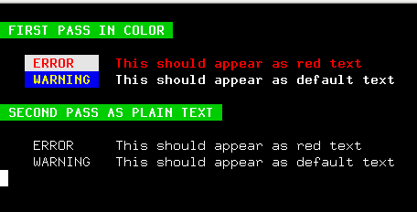
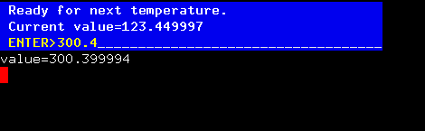
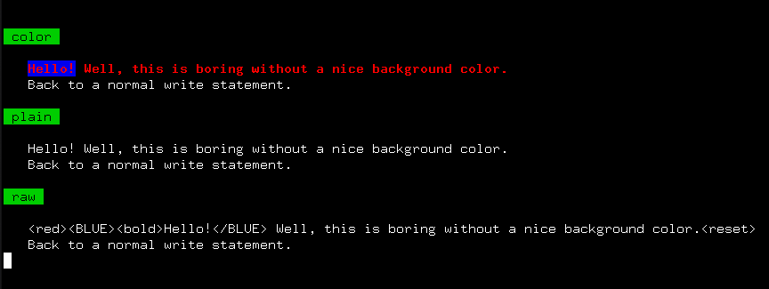

# M_escape.f90 and associated files


## NAME

### M_escape - use in-band signaling to control the text attributes, formatting, color, and other output options on ANSI video text terminals


## DESCRIPTION

   M_escape(3f) is a Fortran module that writes common ANSI escape
   sequences to control terminal attributes like text color. It is
   designed to allow the sequences to be suppressed and for the user
   program to completely customize it -- the user can add, delete and
   replace the sequences associated with a keyword without changing
   the code.

   Attributes are specified by writing lines with XML-like structure.

   The advantage of the approach of replacing in-band escape sequences
   with formatting directives contained on each line is that it is easy
   to turn off when running batch, but more importantly your program can
   be run in "raw" mode and write a clean text file with the directives
   in it that can then be read back in by a simple filter program that
   strips it back to
   [plain text](app/plain.f90)
   or displays it to a screen 
   [in color](app/light.f90)
   or perhaps converts it to HTML or Adobe PDF. By making each line
   self-contained by default this can still be done with any arbitrarily
   selected group of lines from the file.

   So in addition to printing colored lines to your screen this module
   makes it trivial to read specially-formatted data from a file like a
   message catalog (perhaps with various versions in different languages)
   and colorize it or display it as plain text using the included esc(3f)
   procedure, for example.

## DOWNLOAD
   ```bash
       git clone https://github.com/urbanjost/M_escape.git
       cd M_escape/src
       # change Makefile if not using one of the listed compilers
     
       # for gfortran
       make clean
       make F90=gfortran gfortran
     
       # for ifort
       make clean
       make F90=ifort ifort

       # for nvfortran
       make clean
       make F90=nvfortran nvfortran
   ```
   This will compile the M_escape module and example programs.

## SUPPORTS FPM

   Alternatively, download the github repository and build it with
   fpm ( as described at [Fortran Package Manager](https://github.com/fortran-lang/fpm) )

   ```bash
        git clone https://github.com/urbanjost/M_escape.git
        cd M_escape
        fpm build
        fpm test
   ```

   or just list it as a dependency in your fpm.toml project file.

```toml
        [dependencies]
        M_escape        = { git = "https://github.com/urbanjost/M_escape.git" }
```

## FUNCTIONAL SPECIFICATION

**This is how the interface works --**

* call the ESC(3f) function with strings that include syntax like
  "\<attribute\> My regular text \</attribute\>" and the "attribute"
  and "/attribute" names will be replaced with ANSI escape sequences or
  user-defined strings associated with those keywords.


## DOCUMENTATION
The included demo programs provide templates for the most common usage:

- [demo1](test/demo1/default.f90) simple demo setting color
- [demo2](test/demo2/plain.f90)   simple demo setting color but with escape sequences suppressed
- [demo3](test/demo3/raw.f90)     simple demo setting color but in raw echo mode showing input as-is
- [demo4](test/demo4/vt102.f90)   explicit call to set default mode
- [demo5](test/demo5/custom.f90)  how to add, delete, and replace attribute strings
- [demo9](test/demo9/mixed.f90)   multiple modes and mixed attributes

- [demo6](test/demo6/dump.f90)    dump the dictionary. Intended for debugging but might be generally useful.

- [demo7](test/demo7/functional.f90)    use attr(3f) instead of esc(3f) for a more functionally-oriented programming interface

- [demo8](test/demo8/direct.f90)    direct use of named strings of escape codes
- [demo10](test/demo10/color.f90)   alternate fixed strings an color(3f) and colormode(3f)

### manpages
- [M_escape](https://urbanjost.github.io/M_escape/M_escape.3m_escape.html)  -- An overview of the M_escape module
- [esc](https://urbanjost.github.io/M_escape/esc.3m_escape.html)  -- the main function
- [esc_mode](https://urbanjost.github.io/M_escape/esc_mode.3m_escape.html)  -- setting processed or plain output mode
- [update](https://urbanjost.github.io/M_escape/update.3m_escape.html)  -- customizing

- [attr](https://urbanjost.github.io/M_escape/attr.3m_escape.html)  -- alternate function that just takes keywords

- [color](https://urbanjost.github.io/M_escape/color.3m_escape.html)  -- alternate function that just uses string constants
- [color_mode](https://urbanjost.github.io/M_escape/color_mode.3m_escape.html)  -- toggle color from color(3f) on and off

### All manpages amalgamated
- [BOOK_M_escape](https://urbanjost.github.io/M_escape/BOOK_M_escape.html) -- All manpages consolidated using JavaScript

### doxygen

- [doxygen(1) output](https://urbanjost.github.io/M_escape/doxygen_out/html/index.html).

## EXAMPLE PROGRAM

This short program will display red and yellow text on an ANSI-compatible color terminal
or emulator of such:

```fortran
   program demo_M_escape
   use M_escape, only : esc, esc_mode

      write(*,'(/,a,/)')esc('<GREEN><bold><white> FIRST PASS IN COLOR <reset>')
      call printme()

      write(*,'(/,a,/)')esc('<G><bo><w> SECOND PASS AS PLAIN TEXT <reset>')
      call esc_mode(manner='plain')
      call printme()

   contains 
   subroutine printme()
      write(*,'(3x,a)') esc('<W><bo><r> ERROR   </W>  This should appear as red text</y>')
      write(*,'(3x,a)') esc('<B><bo><y> WARNING </B></y>  This should appear as default text')
   end subroutine printme

   end program demo_M_escape
```



------
## ALTERNATIVES

Now, this module is intended to be used to actually try some
of the methods discussed in the [**Fortran Standard Library
project**](https://github.com/fortran-lang/stdlib/issues/229) concerning
displayed colored text at a terminal.  So lets
back up and look at alternatives.

### DIRECT USE OF THE ANSI CONTROL SEQUENCES

If you do not like the XML approach, perhaps you prefer using the escape
sequences directly. Per **@certik**:

    At the lowest level the goal is to output the correct ANSI string
    without having to deal with ANSI sequences directly, but there should
    be no overhead and it should be as simple as possible.

```fortran
      print *, fg_red, bg_green, bold, 'Hello!', reset
```

    This is implemented as
```fortran
   program direct
      use M_escape, only : &
     ! FOREGROUND COLORS
        & fg_red, fg_cyan, fg_magenta, fg_blue, fg_green, fg_yellow, fg_white, fg_ebony, fg_default, &
     ! BACKGROUND COLORS
        & bg_red, bg_cyan, bg_magenta, bg_blue, bg_green, bg_yellow, bg_white, bg_ebony, bg_default, &
     ! ATTRIBUTES
        & bold, italic, inverse, underline,  unbold, unitalic, uninverse, ununderline,  reset, &
     ! DISPLAY
        & clear
      implicit none
	write(*,'(*(g0))')fg_red,bg_green,bold,'Hello!',reset
   end program direct
```


   A more extensive example
```fortran
   program testit
   use M_escape, only : bg_blue, fg_white, reset, fg_yellow, bold, clear
   implicit none
   character(len=47)   :: line
   character(len=256)  :: message
   integer             :: ios
   real                :: value
   
      ! clear screen, set attributes and print messages
      line=' Ready for next temperature.'
      write(*,'(*(a))') clear,bg_blue,fg_white,bold,line,reset
   
      value=123.45
      write(line,'(*(g0))')' Current value=',value
      write(*,'(*(a))') bg_blue,fg_white,bold,line,reset
   
      ! prompt for new value
      write(*,'(*(a))',advance='no') bg_blue,fg_white,repeat('_',len(line)),fg_yellow,bold, char(13),' ENTER>'
   
      ! read new value
      read(*,advance='yes',iostat=ios,fmt='(g20.13)',iomsg=message)value
      write(*,'(a)',advance='no') reset
      if(ios.ne.0)then
         write(*,'(*(g0))')ios,' ',trim(message)
      endif
   
      write(*,'(*(g0))')'value=',value
   end program testit
```


   Nice and simple. The biggest problem is that the constant strings cannot be turned off trivially. 

   The constant strings could be variables instead, with a function that initializes them and sets them
   to null I suppose, but adding a simple function to use the variables and a trivial subroutine to turn
   off the escape sequences is easy enough.

   So simply adding the color(3f) and color_mode(3f) procedures

```fortran
   program direct2
      use M_escape, only : color, color_mode
      use M_escape, only : &
        & fg_red, fg_cyan, fg_magenta, fg_blue, fg_green, fg_yellow, fg_white, fg_ebony, fg_default, &
        & bg_red, bg_cyan, bg_magenta, bg_blue, bg_green, bg_yellow, bg_white, bg_ebony, bg_default, &
        & bold, italic, inverse, underline,  unbold, unitalic, uninverse, ununderline,  reset, &
        & clear
      print *, color('Hello!', fg=fg_red, bg=bg_green, style=bold)
      ! unlike the constants it is easy to turn off the color
      call color_mode(.false.)
      print *, color('Hello!', fg=fg_red, bg=bg_green, style=bold)
       NOTE:
       where supported the isatty(3f) function can be used to turn off the sequences when the file is
       not a tty.
       call color_mode(isatty(stdin)) ! isatty(3f) is an extension, but supported by GNU, Intel, PGI, ...
   end program direct2
```


       ### NOTE:
       where supported the isatty(3f) function can be used to turn off the sequences when the file is
       not a tty.

          call color_mode(isatty(stdin)) 

       isatty(3f) is an extension, but supported by GNU, Intel, PGI, ...

   You could eliminate the fg= and bg= parameters and just concatenate any combination of the strings as
   a style= value as well.

```fortran
      print *, color('Hello!', style=bold//italic/bg_green/fg_red)
```

   **@certik** :: notice that fg_red is not the string "red" but a constant to avoid string
   parsing / comparison, and just efficiently output the ANSI sequence.

   You could also have specific functions for each string and nest them, as I saw in some other implementations,
   but I did not implement that. For example, it could look like:

```fortran
      write(*,*)bg_red(fg_green(style_underline('Hello!')))
```

## HIGHER LEVEL

   **@certik** :: or a more functional programming approach where
   color(3f) can work in many ways, outputting both ANSI or HTML output
   and allowing for turning off colors.

   Well, this is only a step in that direction but this basically works just like esc(3f) but instead
   of putting the attributes in with the text in XML format all of the attributes are moved to the
   attr(3f) function. 

```fortran
   program functional
   use M_escape, only : attr, esc_mode
   implicit none
        write(*,'(a)')attr('clear')
        call printme('color')
        call printme('plain')
        call printme('raw')
   contains

   subroutine printme(mymode)
   character(len=*),intent(in) :: mymode
      call esc_mode('color')
      write(*,'(/,a,/)')attr('GREEN ebony intense',' '//mymode//' ')
      call esc_mode(mymode)
      write(*,'(3x,*(g0))')attr('red:BLUE:bold'),'Hello!', &
       & attr('/BLUE'),' Well, this is boring without a nice background color.',attr('reset')
      write(*,'(3x,*(g0))')'Back to a normal write statement.'
   end subroutine printme

   end program functional
```


### HIGH LEVEL

    **@certik** : some intermediate representation (XML) that can be parsed into,
    and then manipulated to any output (HTML, ANSI, latex, ...)

That is were the esc(3f) function is headed, but right now to do the HTML
or latex output the user would have to use the update(3f) procedure to
change all the keywords to output HTML.

## SEE ALSO

   __The primary purpose for originally creating this module
   was to further and summarize the discussion concerning adding
   ANSI color escape sequences to the [**Fortran Standard Library
   project**](https://github.com/fortran-lang/stdlib/issues/229).

### REFERENCES
* [**Fortran Wiki example**](http://fortranwiki.org/fortran/show/ansi_colors) for an example that covers the basics
* [**Rosetta Code examples**](https://rosettacode.org/wiki/Terminal_control/Coloured_text) for how other languages do color.
  I find the Ncurses, Fortran, bash and C++ examples particularly interesting.
* [**Wikipedia**](https://en.wikipedia.org/wiki/ANSI_escape_code) a description of the basic ANSI escape sequences.
* [**FACE**](https://github.com/szaghi/FACE) A Fortran library for generating ANSI escape sequences
* [**foul**](http://foul.sourceforge.net/) A library for controlling the attributes of output text using Fortran
* [**Fortran Standard Library project**](https://github.com/fortran-lang/stdlib/issues/229) discussion about
  adding ANSI control sequences to the Fortran Standard Library project.
* [terminal colors](http://www.pixelbeat.org/docs/terminal_colours/)

### OF INTEREST
* [ansi2html](https://github.com/ralphbean/ansi2html) ANSI escape codes to HTML from programs and as a bash shell
* [M_ncurses](https://github.com/urbanjost/M_ncurses) A Fortran interface to Ncurses(3c)

### OTHER LANGUAGES

*  [python](https://python-prompt-toolkit.readthedocs.io/en/master/pages/printing_text.html#html) prompt-toolkit

## FEEDBACK

Please provide feedback on the
[wiki](https://github.com/urbanjost/M_escape/wiki) or in the
[__issues__](https://github.com/urbanjost/M_escape/issues) section
and please star the repository if you use the module (or let me know
why not and let others know what you did use!).

-------
