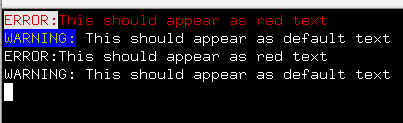

# M_escape.f90 and associated files


## NAME

### M_escape - use in-band signaling to control the text attributes, formatting, color, and other output options on ANSI video text terminals

** This is a WIP __(Work In Progress)__ **

__This is an uncompleted project but basically functional__. If anyone is
interested in seeing this further developed or wishes to contribute
to doing so please let me know; as it will remain a low priority otherwise
that I will "get around to" "one of these days"!

## DESCRIPTION

   M_escape(3f) is a Fortran module that writes common ANSI escape
   sequences to control terminal attributes like text color. It is
   designed to allow the sequences to be suppressed and for the user
   program to completely customize it -- the user can add, delete and
   replace the sequences associated with a keyword without changing
   the code.

   Attributes are specified by writing lines with XML-like structure.

   The advantage of the approach of replacing in-band escape sequences
   with formatting directives contained on each line is that it is easy to
   turn off when running batch, but more importantly your program can be
   run in "raw" mode and write a file with the directives in it that can
   then be read back in by a simple filter program that strips it back to
   [plain text](app/plain/plain.f90)
   or displays it to a screen 
   [in color](app/light/light.f90)
   or converts it
   to HTML or Adobe PDF. By making each line self-contained by default
   this can still be done with any selected group of lines from the file.

   So it is trivial to read specially-formatted data from a file like a
   message catalog (perhaps with various versions in different languages)
   and colorize it or display it as plain text using the esc(3f) procedure,
   for example.

## DOWNLOAD
   ```bash
       git clone https://github.com/urbanjost/M_escape.git
       cd M_escape/src
       # change Makefile if not using gfortran(1)
       make
   ```
   This will compile the M_escape module and example programs.

## SUPPORTS FPM

   Alternatively, download the github repository and build it with
   fpm ( as described at [Fortran Package Manager](https://github.com/fortran-lang/fpm) )

   ```bash
        git clone https://github.com/urbanjost/M_escape.git
        cd M_escape
        fpm build
        fpm test
   ```

   or just list it as a dependency in your fpm.toml project file.

        [dependencies]
        M_escape        = { git = "https://github.com/urbanjost/M_escape.git" }

## FUNCTIONAL SPECIFICATION

**This is how the interface works --**

* call the ESC(3f) function with strings that include syntax like "\<attribute\> My regular text \</attribute\>"
  and the "attribute" and "/attribute" strings will be replaced with ANSI escape sequences or user-defined
  strings associated with those keywords.


## DOCUMENTATION
The included demo programs provide templates for the most common usage:

- [demo1](test/demo1/default.f90) simple demo setting color
- [demo2](test/demo2/plain.f90)   simple demo setting color but with escape sequences suppressed
- [demo3](test/demo3/raw.f90)     simple demo setting color but in raw echo mode showing input as-is
- [demo4](test/demo4/vt102.f90)   explicit call to set default mode
- [demo5](test/demo5/custom.f90)  how to add, delete, and replace attribute strings
- [demo6](test/demo6/dump.f90)    dump the dictionary. Intended for debugging but might be generally useful.
- [demo9](test/demo9/mixed.f90)   multiple modes and mixed attributes

### manpages
- [M_escape](https://urbanjost.github.io/M_escape/M_escape.3m_escape.html)  -- An overview of the M_escape module
- [esc](https://urbanjost.github.io/M_escape/esc.3m_escape.html)  -- the main function
- [esc_mode](https://urbanjost.github.io/M_escape/esc_mode.3m_escape.html)  -- setting processed or plain output mode
- [update](https://urbanjost.github.io/M_escape/update.3m_escape.html)  -- customizing
- [attr](https://urbanjost.github.io/M_escape/attr.3m_escape.html)  -- alternate function that just takes keywords

### All manpages amalgamated
- [BOOK_M_escape](https://urbanjost.github.io/M_escape/BOOK_M_escape.html) -- All manpages consolidated using JavaScript

### doxygen

- [doxygen(1) output](https://urbanjost.github.io/M_escape/doxygen_out/html/index.html).

## EXAMPLE PROGRAM

This short program will display red and yellow text on an ANSI-compatible color terminal
or emulator of such:

```fortran
   program demo_M_escape
   use M_escape, only : esc, esc_mode
      do i=1,2
         write(*,'(a)') esc('<r><W>ERROR:</W>This should appear as red text</y>')
         write(*,'(a)') esc('<y><B>WARNING:</B></y> This should appear as default text')
         call esc_mode(manner='plain')
      enddo
   end program demo_M_escape
```


If you do not like the XML approach, perhaps you prefer using the escape sequences directly

```fortran
   program direct
      use M_escape, only : &
     ! FOREGROUND COLORS
        & fg_red, fg_cyan, fg_magenta, fg_blue, fg_green, fg_yellow, fg_white, fg_ebony, fg_default, &
     ! BACKGROUND COLORS
        & bg_red, bg_cyan, bg_magenta, bg_blue, bg_green, bg_yellow, bg_white, bg_ebony, bg_default, &
     ! ATTRIBUTES
        & bold, italic, inverse, underline,  unbold, unitalic, uninverse, ununderline,  reset, &
     ! DISPLAY
        & clear
      implicit none
	write(*,'(*(g0))')fg_red,bg_green,bold,'Hello!',reset
   end program direct
```

or a more functional programming approach

```fortran
   program functional
   use M_escape, only : attr, esc_mode
   implicit none
        call printme('color')
        call printme('plain')
        call printme('raw')
   contains
   subroutine printme(mymode)
   character(len=*),intent(in) :: mymode
      call esc_mode(mymode)
      write(*,'(a)')mymode
      write(*,'(*(g0))',advance='no')attr('red:BLUE:bold'),'Hello!', &
       & attr('/BLUE'),' Well, this is boring without a nice background color.',attr('reset')
      write(*,'(*(g0))',advance='yes')' Back to a normal write statement.'
   end subroutine printme
   end program functional
```

## SEE ALSO

* [**Fortran Wiki example**](http://fortranwiki.org/fortran/show/ansi_colors) for an example that covers the basics
* [**Rosetta Code examples**](https://rosettacode.org/wiki/Terminal_control/Coloured_text) for how other languages do color.
  I find the Ncurses, Fortran, bash and C++ examples particularly interesting.
* [**Wikipedia**](https://en.wikipedia.org/wiki/ANSI_escape_code) a description of the basic ANSI escape sequences.
* [**FACE**](https://github.com/szaghi/FACE) A Fortran library for generating ANSI escape sequences
* [**foul**](http://foul.sourceforge.net/) A library for controlling the attributes of output text using Fortran
* [**Fortran Standard Library project**](https://github.com/fortran-lang/stdlib/issues/229) discussion about
  adding ANSI control sequences to the Fortran Standard Library project.
* [terminal colors](http://www.pixelbeat.org/docs/terminal_colours/)

## OF INTEREST
* [ansi2html](https://github.com/ralphbean/ansi2html) ANSI escape codes to HTML from programs and as a bash shell
* [M_ncurses](https://github.com/urbanjost/M_ncurses) A Fortran interface to Ncurses(3c)

## OTHER LANGUAGES

*  [python](https://python-prompt-toolkit.readthedocs.io/en/master/pages/printing_text.html#html) prompt-toolkit

## FEEDBACK

Please provide feedback on the
[wiki](https://github.com/urbanjost/M_escape/wiki) or in the
[__issues__](https://github.com/urbanjost/M_escape/issues) section
and please star the repository if you use the module (or let me know
why not and let others know what you did use!).

-------
